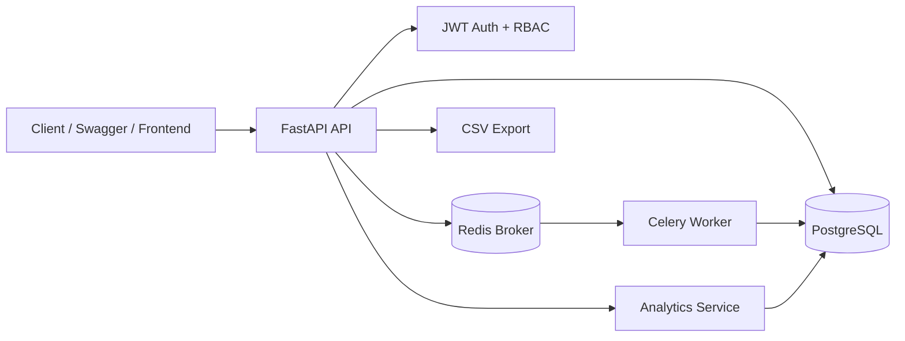
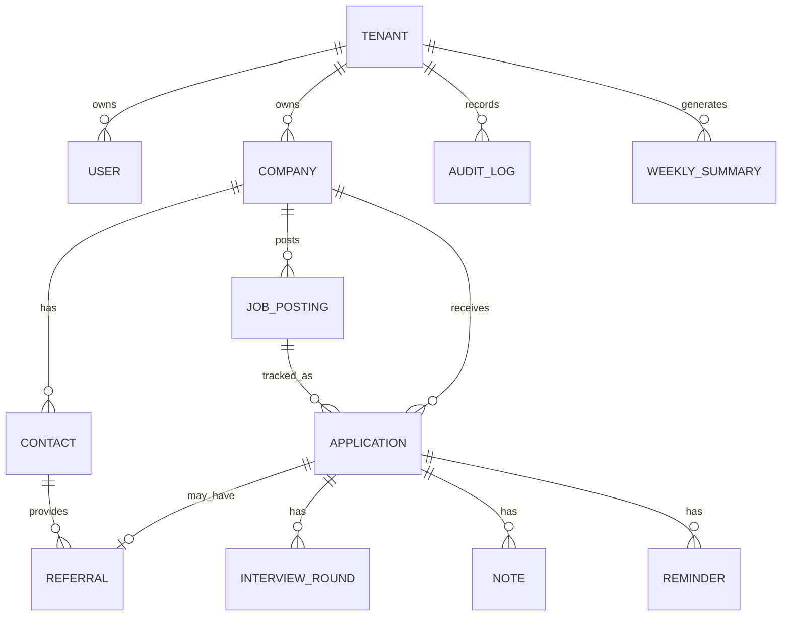

# JobTrack CRM Backend

Production-style FastAPI + PostgreSQL backend for a multi-tenant job/application CRM.

This is not another `tasks` table wearing a fake moustache. It models a real job hunt: companies, job postings, applications, referrals, contacts, notes, interviews, reminders, audit logs, CSV exports, analytics, and background weekly summaries.

## Why this project exists

This project is designed for Python Backend / FastAPI / REST API / SQL Python Developer roles. It demonstrates the exact backend skills recruiters usually want but rarely see together in beginner projects:

- FastAPI app structure with routers and dependency injection
- PostgreSQL + SQLAlchemy ORM
- Alembic migration setup
- Pydantic request/response validation
- JWT authentication
- Role-based access control: `admin` and `user`
- Multi-tenant data isolation
- CRUD APIs for users, companies, contacts, jobs, applications, referrals, interviews, notes, and reminders
- Search, filtering, sorting, and pagination
- Audit logs for important changes
- Analytics endpoints
- CSV export
- Redis + Celery background job
- Docker Compose deployment
- pytest API tests
- GitHub Actions CI

## Architecture



## Main domain model



## Folder structure

```text
jobtrack_crm/
├── app/
│   ├── api/                 # FastAPI routers + dependencies
│   ├── core/                # config, security, exception handling
│   ├── db/                  # SQLAlchemy session + Base imports
│   ├── models/              # SQLAlchemy ORM models
│   ├── schemas/             # Pydantic schemas
│   ├── services/            # analytics and audit service logic
│   ├── tasks/               # Celery tasks
│   └── worker/              # Celery app
├── alembic/                 # migrations
├── tests/                   # pytest API tests
├── scripts/                 # startup + seed scripts
├── docs/                    # screenshots and HTTP examples
├── docker-compose.yml
├── Dockerfile
├── requirements.txt
└── README.md
```

## Step-by-step: run with Docker Compose

### 1. Unzip and enter the project

```bash
unzip jobtrack_crm.zip
cd jobtrack_crm
```

### 2. Confirm `.env` exists

The ZIP already includes a local `.env`. For normal GitHub usage, keep `.env.example` committed and keep real `.env` private.

```bash
cat .env
```

### 3. Start API, PostgreSQL, Redis, and Celery

```bash
docker compose up --build
```

The API will run at:

```text
http://localhost:8000
```

Swagger docs:

```text
http://localhost:8000/docs
```

Health endpoint:

```text
http://localhost:8000/api/v1/health
```

### 4. Seed demo data

Open another terminal inside the project folder:

```bash
docker compose exec api python scripts/seed.py
```

Demo login:

```text
email: sahil@example.com
password: Password123!
```

### 5. Use Swagger auth

1. Open `http://localhost:8000/docs`
2. Use `POST /api/v1/auth/login`
3. Enter:
   - username: `sahil@example.com`
   - password: `Password123!`
4. Copy the `access_token`
5. Click **Authorize** in Swagger
6. Paste:

```text
Bearer <your_token_here>
```

Now call protected endpoints like `/companies`, `/applications`, `/analytics/summary`.

## If Docker gives `docker-credential-desktop` error

If you see this nonsense parade:

```text
error getting credentials - err: exec: "docker-credential-desktop": executable file not found in $PATH
```

Fix it on macOS/Linux:

```bash
nano ~/.docker/config.json
```

Remove this line if present:

```json
"credsStore": "desktop"
```

Or change it to:

```json
"credStore": "osxkeychain"
```

If Docker Desktop is not installed/running, start it first. Then retry:

```bash
docker compose up --build
```

## Run tests

Inside Docker:

```bash
docker compose exec api pytest
```

Local machine:

```bash
python -m venv .venv
source .venv/bin/activate
pip install -r requirements.txt
pytest
```

The tests use SQLite for speed and isolation. The app itself runs on PostgreSQL in Docker.

## Useful API examples

### Register a new tenant/admin

```bash
curl -X POST http://localhost:8000/api/v1/auth/register \
  -H "Content-Type: application/json" \
  -d '{
    "tenant_name": "My Job Hunt",
    "email": "admin@example.com",
    "full_name": "Admin User",
    "password": "Password123!"
  }'
```

### Login

```bash
curl -X POST http://localhost:8000/api/v1/auth/login \
  -H "Content-Type: application/x-www-form-urlencoded" \
  -d "username=admin@example.com&password=Password123!"
```

Set token:

```bash
export TOKEN="paste_token_here"
```

### Create a company

```bash
curl -X POST http://localhost:8000/api/v1/companies \
  -H "Authorization: Bearer $TOKEN" \
  -H "Content-Type: application/json" \
  -d '{
    "name": "Qualcomm",
    "location": "Hyderabad",
    "industry": "Semiconductors",
    "notes": "Referral received. High priority."
  }'
```

### Create a job posting

```bash
curl -X POST http://localhost:8000/api/v1/job-postings \
  -H "Authorization: Bearer $TOKEN" \
  -H "Content-Type: application/json" \
  -d '{
    "company_id": "replace_company_id",
    "role_title": "Automation Engineer",
    "external_job_id": "3091673",
    "source": "Referral",
    "location": "Bangalore",
    "salary_min_lpa": 18,
    "salary_max_lpa": 30,
    "status": "open",
    "description": "Python automation, backend tools, system testing."
  }'
```

### Create an application

```bash
curl -X POST http://localhost:8000/api/v1/applications \
  -H "Authorization: Bearer $TOKEN" \
  -H "Content-Type: application/json" \
  -d '{
    "company_id": "replace_company_id",
    "job_posting_id": "replace_job_id",
    "resume_version": "R1-Python-Backend",
    "status": "applied",
    "priority": "urgent",
    "source": "referral",
    "notes": "Applied after referral. Follow up in 4 days."
  }'
```

### Search and filter applications

```bash
curl "http://localhost:8000/api/v1/applications?q=python&status_filter=applied&location=Bangalore&limit=10&offset=0" \
  -H "Authorization: Bearer $TOKEN"
```

### Get analytics

```bash
curl http://localhost:8000/api/v1/analytics/summary \
  -H "Authorization: Bearer $TOKEN"
```

Example response:

```json
{
  "applications_by_status": {
    "applied": 4,
    "interview": 2,
    "rejected": 1
  },
  "referral_conversion_rate": 50.0,
  "interviews_per_week": {
    "2026-W26": 2
  },
  "top_companies_by_response_rate": [
    {
      "company": "Qualcomm",
      "applications": 2,
      "responses": 1,
      "response_rate": 50.0
    }
  ],
  "totals": {
    "applications": 7,
    "referrals": 3,
    "interviews": 2
  }
}
```

### Export applications as CSV

```bash
curl http://localhost:8000/api/v1/applications/export/csv \
  -H "Authorization: Bearer $TOKEN" \
  -o applications.csv
```

### Trigger weekly summary background job

```bash
curl -X POST http://localhost:8000/api/v1/analytics/weekly-summary \
  -H "Authorization: Bearer $TOKEN"
```

Then check task status:

```bash
curl http://localhost:8000/api/v1/tasks/replace_task_id \
  -H "Authorization: Bearer $TOKEN"
```

## Endpoint map

| Area | Endpoints |
|---|---|
| Auth | `POST /auth/register`, `POST /auth/login`, `GET /auth/me` |
| Users | `GET/POST /users`, `GET/PATCH/DELETE /users/{id}` |
| Companies | `GET/POST /companies`, `GET/PATCH/DELETE /companies/{id}` |
| Contacts | `GET/POST /contacts`, `GET/PATCH/DELETE /contacts/{id}` |
| Jobs | `GET/POST /job-postings`, `GET/PATCH/DELETE /job-postings/{id}` |
| Applications | `GET/POST /applications`, `GET/PATCH/DELETE /applications/{id}`, `GET /applications/export/csv` |
| Referrals | `GET/POST /referrals`, `GET/PATCH/DELETE /referrals/{id}` |
| Interviews | `GET/POST /interviews`, `GET/PATCH/DELETE /interviews/{id}` |
| Notes | `GET/POST /notes`, `GET/PATCH/DELETE /notes/{id}` |
| Reminders | `GET/POST /reminders`, `GET/PATCH/DELETE /reminders/{id}` |
| Audit | `GET /audit-logs` |
| Analytics | `GET /analytics/summary`, `POST /analytics/weekly-summary`, `GET /analytics/weekly-summaries` |
| Tasks | `GET /tasks/{task_id}` |
| Health | `GET /health` |

All protected endpoints enforce tenant isolation using the authenticated user's `tenant_id`.

## Failure cases handled

| Failure | Result |
|---|---|
| Duplicate email registration | `409 Conflict` |
| Duplicate tenant name | `409 Conflict` |
| Invalid login | `400 Bad Request` |
| Missing/invalid JWT | `401 Unauthorized` |
| Non-admin creating users | `403 Forbidden` |
| Accessing another tenant's data | `404 Not Found` |
| Invalid request body | `422 Validation Error` |
| Company/job reference mismatch | `400 Bad Request` |
| Foreign key/unique violation | structured `409` DB error |

## Common commands

```bash
# Start everything
docker compose up --build

# Stop and remove volumes
docker compose down -v

# Run migrations manually
docker compose exec api alembic upgrade head

# Seed demo data
docker compose exec api python scripts/seed.py

# Run tests
docker compose exec api pytest

# See logs
docker compose logs -f api worker
```

